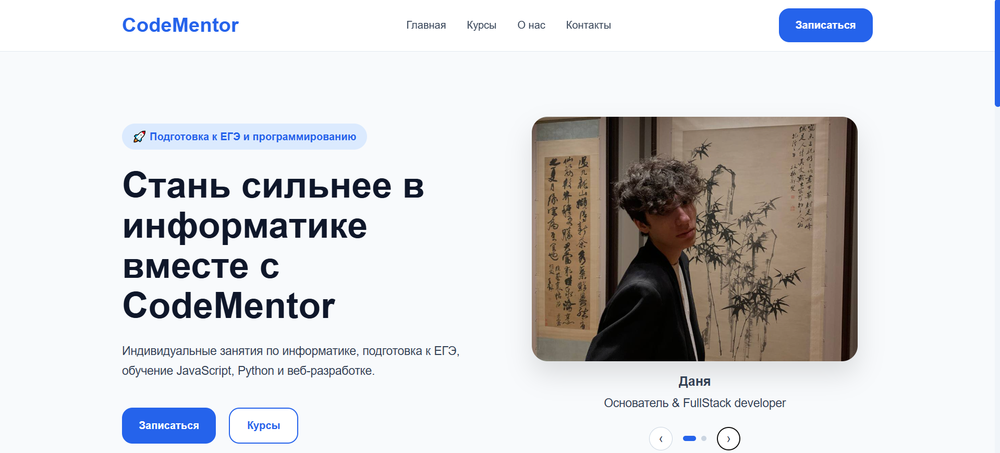
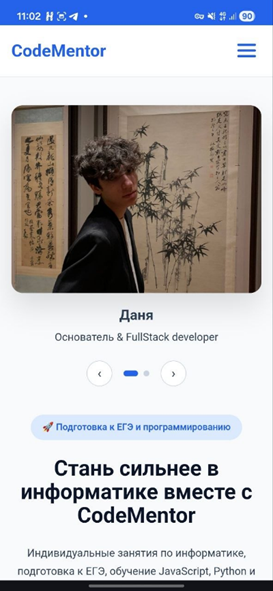
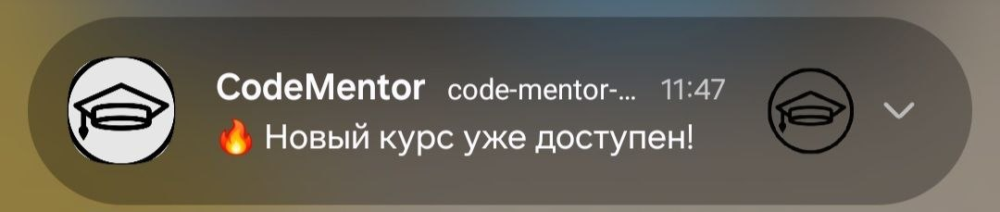
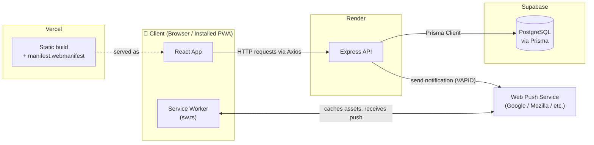
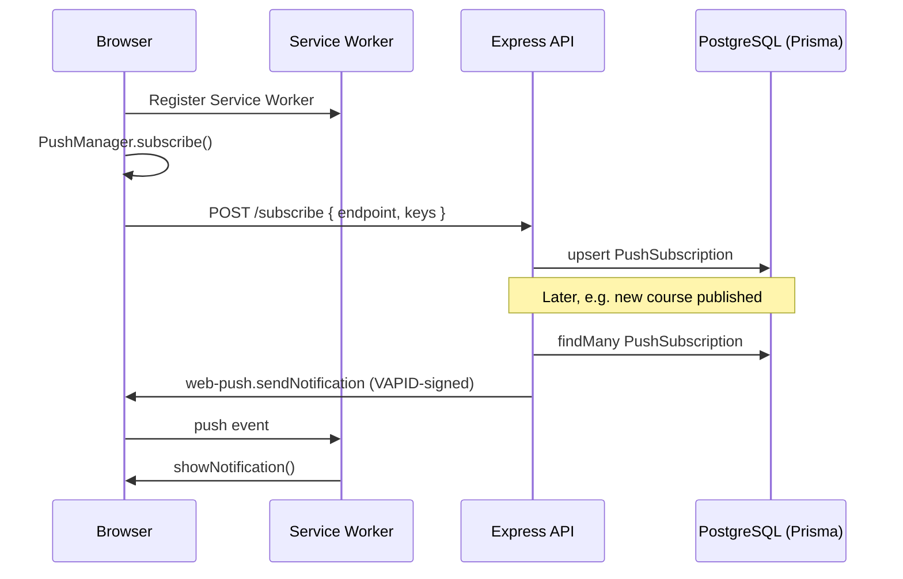

# 📚 CodeMentor

**An educational platform for programming courses, built as an installable Progressive Web App with real-time push notifications.**

[](https://code-mentor-inky.vercel.app/)


🔗 **Live app:** [code-mentor-inky.vercel.app](https://code-mentor-inky.vercel.app/)

> 🇷🇺 Русская версия: [README.ru.md](./README.ru.md)

---

## 📸 Preview





## Table of Contents

- [Overview](#overview)
- [Features](#features)
- [Tech Stack](#tech-stack)
- [Architecture](#architecture)
- [Push Notifications Flow](#push-notifications-flow)
- [Project Structure](#project-structure)
- [Getting Started](#getting-started)
- [Environment Variables](#environment-variables)
- [Database Schema](#database-schema)
- [API Reference](#api-reference)
- [Roadmap](#roadmap)
- [License](#license)
- [Author](#author)

## Overview

CodeMentor is a course-catalog platform where visitors can browse available programming courses and submit an application to enroll. The frontend is a fully installable **Progressive Web App** — it works offline, lives on the home screen like a native app, and can send **push notifications** to re-engage users even when the app isn't open.

The project is split into two independently deployed services and a hosted Postgres database:

| Layer | Technology | Hosting |
|---|---|---|
| Frontend | React + Vite (PWA) | [Vercel](https://vercel.com) |
| Backend  | Express (Node.js/TypeScript) | [Render](https://render.com) |
| Database | PostgreSQL via Prisma | [Supabase](https://supabase.com) |

## Features

- 🎓 **Course catalog** — browse programming courses, live-filtered by a search box, with title, description, duration and price
- 📄 **Course details** — a dedicated page per course with a built-in enrollment form
- 📝 **Enrollment applications** — visitors submit their name, email and phone; stored via the `/api/applications` endpoint
- 📲 **Installable PWA** — a custom in-app "Install" button (wrapping the `beforeinstallprompt` event, with a manual walkthrough modal for iOS, where that event doesn't exist) plus standalone launch with its own icon
- 🔌 **Offline-ready** — static assets are precached by a custom Service Worker (Workbox `injectManifest`)
- 🔔 **Web Push notifications** — an in-app "Enable notifications" card lets users subscribe and even trigger a test push, powered by VAPID-authenticated `web-push` on the server
- 🌐 **Marketing pages** — Home, About (team + stats) and Contact, plus a placeholder Admin route reserved for future course/application management (see [Roadmap](#roadmap))

## Tech Stack

**Frontend**
- React 19 + TypeScript
- Vite 8 as the build tool
- `vite-plugin-pwa` (Workbox `injectManifest` strategy) for Manifest + Service Worker
- React Router for client-side routing
- Axios for HTTP requests to the API
- Plain CSS (per-component stylesheets under `src/styles/components`) — no CSS framework

**Backend**
- Node.js + Express 5, written in TypeScript, run with `tsx`
- Prisma ORM against a PostgreSQL database (Supabase)
- `web-push` for sending VAPID-signed Web Push notifications
- `dotenv` for environment configuration, `cors` for cross-origin access from the frontend

**Infrastructure**
- Vercel — frontend hosting & CDN
- Render — backend API hosting
- Supabase — managed PostgreSQL

## Architecture



The frontend and Service Worker are served statically from Vercel; the Express API and database run independently on Render and Supabase. This separation means the API can be redeployed or scaled without touching the PWA shell, and vice versa.

## Push Notifications Flow



## Project Structure

```
CodeMentor/
├── .gitignore
│
├── frontend/
│   ├── public/
│   │   ├── favicon.svg
│   │   ├── icons.svg
│   │   ├── pwa-192x192.png
│   │   └── pwa-512x512.png
│   ├── src/
│   │   ├── assets/
│   │   ├── components/
│   │   │   ├── common/          # CourseCard, InstallButton, NotificationButton
│   │   │   ├── forms/           # ApplicationForm
│   │   │   ├── home/            # Hero, Advantages, CoursesPreview
│   │   │   ├── layout/          # Navbar, Footer, Layout
│   │   │   └── ui/              # Button, Container, Input
│   │   ├── data/                # static content (e.g. advantages.ts)
│   │   ├── pages/                # Home, Courses, Course, About, Contact, Admin
│   │   ├── router/               # createBrowserRouter route definitions
│   │   ├── services/
│   │   │   └── courseApi.ts     # Axios client: courses, applications, push
│   │   ├── styles/
│   │   ├── types/
│   │   ├── App.tsx
│   │   ├── main.tsx
│   │   ├── sw.ts               # Custom Service Worker (injectManifest strategy)
│   │   └── vite-env.d.ts
│   ├── index.html
│   ├── vite.config.ts          # VitePWA manifest + Service Worker config
│   └── package.json
│
└── backend/
    ├── prisma/
    │   ├── migrations/
    │   └── schema.prisma
    ├── src/
    │   ├── config/
    │   │   ├── prisma.ts        # Prisma Client instance
    │   │   └── push.ts          # VAPID setup for web-push
    │   ├── controllers/
    │   │   ├── course.controller.ts
    │   │   ├── application.controller.ts
    │   │   └── push.controller.ts
    │   ├── services/
    │   │   ├── course.service.ts
    │   │   ├── application.service.ts
    │   │   └── push.service.ts
    │   ├── routes/
    │   │   ├── course.routes.ts
    │   │   ├── application.routes.ts
    │   │   └── push.routes.ts
    │   ├── middleware/
    │   ├── types/
    │   ├── utils/
    │   ├── app.ts                # Express app + route mounting
    │   └── server.ts             # Entry point, starts the HTTP server
    ├── prisma.config.ts
    └── package.json
```

## Getting Started

### Prerequisites

- Node.js 18+
- A PostgreSQL database (e.g. a free [Supabase](https://supabase.com) project)
- A pair of VAPID keys — generate with `npx web-push generate-vapid-keys`

### 1. Clone the repository

```bash
git clone https://github.com/<your-username>/CodeMentor.git
cd CodeMentor
```

### 2. Backend setup

```bash
cd backend
npm install
cp .env.example .env   # fill in the values, see below
npx prisma generate
npx prisma migrate dev
npm run dev            # starts the API with tsx watch
```

### 3. Frontend setup

```bash
cd frontend
npm install
cp .env.example .env   # fill in the values, see below
npm run dev            # starts Vite dev server
```

The frontend expects the API URL in `VITE_API_URL`; make sure it points at your local backend (e.g. `http://localhost:5000`) during development. Note that `courseApi.ts` appends `/api` to this base URL itself.

### 4. Build for production

```bash
# backend
npm run build && npm start

# frontend
npm run build           # generates manifest.webmanifest + sw.js in dist/
npm run preview
```

## Environment Variables

### Backend (`backend/.env`)

| Variable | Description |
|---|---|
| `DATABASE_URL` | Pooled Postgres connection string (Supabase) used by Prisma at runtime |
| `DIRECT_URL` | Direct (non-pooled) Postgres connection string, used by Prisma for migrations |
| `VAPID_PUBLIC_KEY` | Public VAPID key, shared with the frontend to subscribe to push |
| `VAPID_PRIVATE_KEY` | Private VAPID key, used server-side to sign push messages — **never expose this** |
| `VAPID_SUBJECT` | Contact identifier for the push service (a `mailto:` email or a URL) |

### Frontend (`frontend/.env`)

| Variable | Description |
|---|---|
| `VITE_API_URL` | Base URL of the backend API |
| `VITE_VAPID_PUBLIC_KEY` | Public VAPID key, used by `PushManager.subscribe()` in the browser |

> ⚠️ Never commit real `.env` files. Only `VAPID_PUBLIC_KEY` / `VITE_VAPID_PUBLIC_KEY` are safe to expose to the client — the private key must stay on the server only.

## Database Schema

Defined in `backend/prisma/schema.prisma`, three models back the app:

| Model | Purpose | Key fields |
|---|---|---|
| `Course` | Programming courses shown in the catalog | `title`, `description`, `duration`, `price` |
| `Application` | Enrollment requests submitted by visitors | `name`, `email`, `phone` |
| `PushSubscription` | Stored Web Push subscriptions | `endpoint` (unique), `p256dh`, `auth` |

## API Reference

All routes are mounted under the `/api` prefix in `app.ts`.

### Courses — `/api/courses`

| Method | Endpoint | Description |
|---|---|---|
| `GET` | `/api/courses` | List all courses, ordered by `id` ascending |
| `GET` | `/api/courses/:id` | Get a single course by id — returns `404` if not found |

### Applications — `/api/applications`

| Method | Endpoint | Description |
|---|---|---|
| `POST` | `/api/applications` | Create a new enrollment application. Body: `{ name, email, phone }` |

### Push Notifications — `/api/push`

| Method | Endpoint | Description |
|---|---|---|
| `POST` | `/api/push/subscribe` | Saves (upserts) a browser's push subscription. Body: `{ endpoint, keys: { p256dh, auth } }` |
| `POST` | `/api/push/send` | Sends a push notification to every stored subscription |

All controllers follow the same thin **controller → service → Prisma** pattern, catch errors, and return a `500 { message: "Internal server error" }` on failure.

## Roadmap

- [ ] Admin panel to manage courses and view applications
- [ ] Per-user (not just broadcast) push notifications
- [ ] Automated tests for the API layer
- [ ] CI/CD pipeline (lint + build on pull request)

## License

This project is licensed under the [MIT License](LICENSE).

## Author

Built by **[Your Name]** — [GitHub](https://github.com/<your-username>) · [LinkedIn](https://linkedin.com/in/<your-username>)
