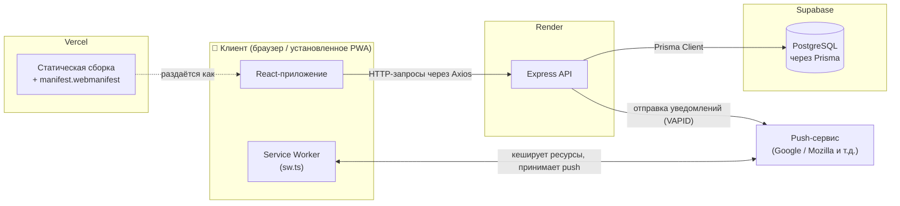
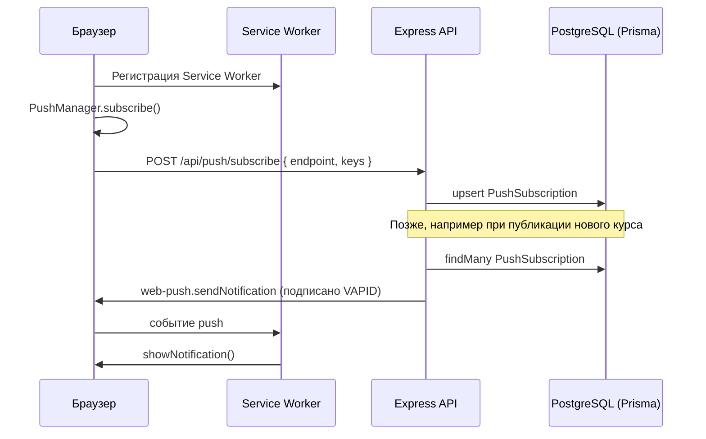

# 📚 CodeMentor

**Образовательная платформа с каталогом курсов по программированию, реализованная как устанавливаемое Progressive Web App с push-уведомлениями в реальном времени.**

[](https://code-mentor-inky.vercel.app/)


🔗 **Рабочая версия:** [code-mentor-inky.vercel.app](https://code-mentor-inky.vercel.app/)

> 🇬🇧 English version: [README.md](./README.md)

---

## 📸 Превью


## Содержание

- [Обзор](#обзор)
- [Возможности](#возможности)
- [Технологический стек](#технологический-стек)
- [Архитектура](#архитектура)
- [Как работают Push-уведомления](#как-работают-push-уведомления)
- [Структура проекта](#структура-проекта)
- [Быстрый старт](#быстрый-старт)
- [Переменные окружения](#переменные-окружения)
- [Схема базы данных](#схема-базы-данных)
- [API Reference](#api-reference)
- [Планы по развитию](#планы-по-развитию)
- [Лицензия](#лицензия)
- [Автор](#автор)

## Обзор

CodeMentor — платформа с каталогом курсов по программированию, где посетители могут просматривать доступные курсы и оставлять заявку на обучение. Frontend полностью реализован как **Progressive Web App** — приложение работает офлайн, устанавливается на главный экран как нативное, а также умеет отправлять **push-уведомления**, даже когда вкладка с приложением закрыта.

Проект разделён на два независимо развёрнутых сервиса и облачную базу данных:

| Слой        | Технология                   | Хостинг                          |
| ----------- | ---------------------------- | -------------------------------- |
| Frontend    | React + Vite (PWA)           | [Vercel](https://vercel.com)     |
| Backend     | Express (Node.js/TypeScript) | [Render](https://render.com)     |
| База данных | PostgreSQL через Prisma      | [Supabase](https://supabase.com) |

## Возможности

- 🎓 **Каталог курсов** — список курсов с живым поиском по названию, а также описанием, длительностью и стоимостью
- 📄 **Страница курса** — отдельная страница по каждому курсу со встроенной формой записи
- 📝 **Заявки на обучение** — посетители оставляют имя, email и телефон; заявка сохраняется через `/api/applications`
- 📲 **Устанавливаемое PWA** — собственная кнопка «Установить» (обёртка над событием `beforeinstallprompt`, с отдельной пошаговой модалкой для iOS, где такого события нет) плюс запуск в отдельном окне со своей иконкой
- 🔌 **Работа офлайн** — статические ресурсы кешируются кастомным Service Worker (Workbox, стратегия `injectManifest`)
- 🔔 **Web Push уведомления** — карточка «Включить уведомления» в интерфейсе позволяет подписаться и отправить тестовый push, на сервере это реализовано через VAPID-подписанные сообщения (`web-push`)
- 🌐 **Информационные страницы** — Home, About (команда + статистика) и Contact, а также служебный роут Admin, зарезервированный под будущее управление курсами/заявками (см. [Планы по развитию](#планы-по-развитию))

## Технологический стек

**Frontend**

- React 19 + TypeScript
- Vite 8 как сборщик
- `vite-plugin-pwa` (стратегия Workbox `injectManifest`) для Manifest и Service Worker
- React Router для маршрутизации на клиенте
- Axios для HTTP-запросов к API
- Обычный CSS (стили по компонентам в `src/styles/components`) — без CSS-фреймворка

**Backend**

- Node.js + Express 5 на TypeScript, запуск через `tsx`
- Prisma ORM поверх PostgreSQL (Supabase)
- `web-push` для отправки VAPID-подписанных Web Push уведомлений
- `dotenv` для конфигурации окружения, `cors` для кросс-доменных запросов с фронтенда

**Инфраструктура**

- Vercel — хостинг и CDN для frontend
- Render — хостинг backend API
- Supabase — управляемый PostgreSQL

## Архитектура



Frontend и Service Worker раздаются статически с Vercel; Express API и база данных работают независимо на Render и Supabase. Такое разделение позволяет обновлять или масштабировать API, не трогая PWA-оболочку, и наоборот.

## Как работают Push-уведомления



## Структура проекта

```
CodeMentor/
├── .gitignore
│
├── frontend/
│   ├── public/
│   │   ├── favicon.svg
│   │   ├── icons.svg
│   │   ├── pwa-192x192.png
│   │   └── pwa-512x512.png
│   ├── src/
│   │   ├── assets/
│   │   ├── components/
│   │   │   ├── common/          # CourseCard, InstallButton, NotificationButton
│   │   │   ├── forms/           # ApplicationForm
│   │   │   ├── home/            # Hero, Advantages, CoursesPreview
│   │   │   ├── layout/          # Navbar, Footer, Layout
│   │   │   └── ui/              # Button, Container, Input
│   │   ├── data/                # статический контент (например advantages.ts)
│   │   ├── pages/                # Home, Courses, Course, About, Contact, Admin
│   │   ├── router/               # определение маршрутов через createBrowserRouter
│   │   ├── services/
│   │   │   └── courseApi.ts     # Axios-клиент: курсы, заявки, push
│   │   ├── styles/
│   │   ├── types/
│   │   ├── App.tsx
│   │   ├── main.tsx
│   │   ├── sw.ts               # Кастомный Service Worker (стратегия injectManifest)
│   │   └── vite-env.d.ts
│   ├── index.html
│   ├── vite.config.ts          # Конфигурация VitePWA (manifest + Service Worker)
│   └── package.json
│
└── backend/
    ├── prisma/
    │   ├── migrations/
    │   └── schema.prisma
    ├── src/
    │   ├── config/
    │   │   ├── prisma.ts        # Инстанс Prisma Client
    │   │   └── push.ts          # Настройка VAPID для web-push
    │   ├── controllers/
    │   │   ├── course.controller.ts
    │   │   ├── application.controller.ts
    │   │   └── push.controller.ts
    │   ├── services/
    │   │   ├── course.service.ts
    │   │   ├── application.service.ts
    │   │   └── push.service.ts
    │   ├── routes/
    │   │   ├── course.routes.ts
    │   │   ├── application.routes.ts
    │   │   └── push.routes.ts
    │   ├── middleware/
    │   ├── types/
    │   ├── utils/
    │   ├── app.ts                # Express-приложение + подключение роутов
    │   └── server.ts             # Точка входа, запуск HTTP-сервера
    ├── prisma.config.ts
    └── package.json
```

## Быстрый старт

### Требования

- Node.js 18+
- База данных PostgreSQL (например, бесплатный проект в [Supabase](https://supabase.com))
- Пара VAPID-ключей — генерируется командой `npx web-push generate-vapid-keys`

### 1. Клонирование репозитория

```bash
git clone https://github.com/<your-username>/CodeMentor.git
cd CodeMentor
```

### 2. Настройка backend

```bash
cd backend
npm install
cp .env.example .env   # заполнить значения, см. раздел ниже
npx prisma generate
npx prisma migrate dev
npm run dev            # запускает API через tsx watch
```

### 3. Настройка frontend

```bash
cd frontend
npm install
cp .env.example .env   # заполнить значения, см. раздел ниже
npm run dev            # запускает dev-сервер Vite
```

Frontend ожидает адрес API в переменной `VITE_API_URL` — убедись, что она указывает на локальный backend (например, `http://localhost:5000`) во время разработки. `courseApi.ts` сам добавляет `/api` к этому базовому адресу.

### 4. Сборка для продакшена

```bash
# backend
npm run build && npm start

# frontend
npm run build           # генерирует manifest.webmanifest + sw.js в dist/
npm run preview
```

## Переменные окружения

### Backend (`backend/.env`)

| Переменная          | Описание                                                                                             |
| ------------------- | ---------------------------------------------------------------------------------------------------- |
| `DATABASE_URL`      | Строка подключения к Postgres через пул соединений (Supabase), используется Prisma в рантайме        |
| `DIRECT_URL`        | Прямая (без пула) строка подключения к Postgres, используется Prisma для миграций                    |
| `VAPID_PUBLIC_KEY`  | Публичный VAPID-ключ, передаётся на фронтенд для подписки на push                                    |
| `VAPID_PRIVATE_KEY` | Приватный VAPID-ключ, используется на сервере для подписи push-сообщений — **никогда не раскрывать** |
| `VAPID_SUBJECT`     | Контактный идентификатор для push-сервиса (email вида `mailto:` или URL)                             |

### Frontend (`frontend/.env`)

| Переменная              | Описание                                                                |
| ----------------------- | ----------------------------------------------------------------------- |
| `VITE_API_URL`          | Базовый адрес backend API                                               |
| `VITE_VAPID_PUBLIC_KEY` | Публичный VAPID-ключ, используется `PushManager.subscribe()` в браузере |

> ⚠️ Коммитить реальные `.env`-файлы. Клиенту безопасно раскрывать только `VAPID_PUBLIC_KEY` / `VITE_VAPID_PUBLIC_KEY` — приватный ключ должен оставаться только на сервере.

## Схема базы данных

Описана в `backend/prisma/schema.prisma`, приложение опирается на три модели:

| Модель             | Назначение                        | Ключевые поля                               |
| ------------------ | --------------------------------- | ------------------------------------------- |
| `Course`           | Курсы программирования в каталоге | `title`, `description`, `duration`, `price` |
| `Application`      | Заявки на обучение от посетителей | `name`, `email`, `phone`                    |
| `PushSubscription` | Сохранённые подписки на Web Push  | `endpoint` (уникальный), `p256dh`, `auth`   |

## API Reference

Все роуты подключены с префиксом `/api` в `app.ts`.

### Курсы — `/api/courses`

| Метод | Эндпоинт           | Описание                                                   |
| ----- | ------------------ | ---------------------------------------------------------- |
| `GET` | `/api/courses`     | Список всех курсов, отсортированных по `id` по возрастанию |
| `GET` | `/api/courses/:id` | Получить курс по id — возвращает `404`, если не найден     |

### Заявки — `/api/applications`

| Метод  | Эндпоинт            | Описание                                                         |
| ------ | ------------------- | ---------------------------------------------------------------- |
| `POST` | `/api/applications` | Создать новую заявку на обучение. Тело: `{ name, email, phone }` |

### Push-уведомления — `/api/push`

| Метод  | Эндпоинт              | Описание                                                                                   |
| ------ | --------------------- | ------------------------------------------------------------------------------------------ |
| `POST` | `/api/push/subscribe` | Сохраняет (upsert) подписку браузера на push. Тело: `{ endpoint, keys: { p256dh, auth } }` |
| `POST` | `/api/push/send`      | Отправляет push-уведомление всем сохранённым подпискам                                     |

Все контроллеры следуют единому паттерну **controller → service → Prisma**, перехватывают ошибки и при сбое возвращают `500 { message: "Internal server error" }`.

## Планы по развитию

- [ ] Админ-панель для управления курсами и просмотра заявок
- [ ] Персональные (не только массовые) push-уведомления
- [ ] Автоматические тесты для API-слоя
- [ ] CI/CD-пайплайн (линтинг + сборка при pull request)

## Автор

Разработано **Тульским Даниилом** — [GitHub](https://github.com/Dantul1337) · [Telegram](@dantul)
